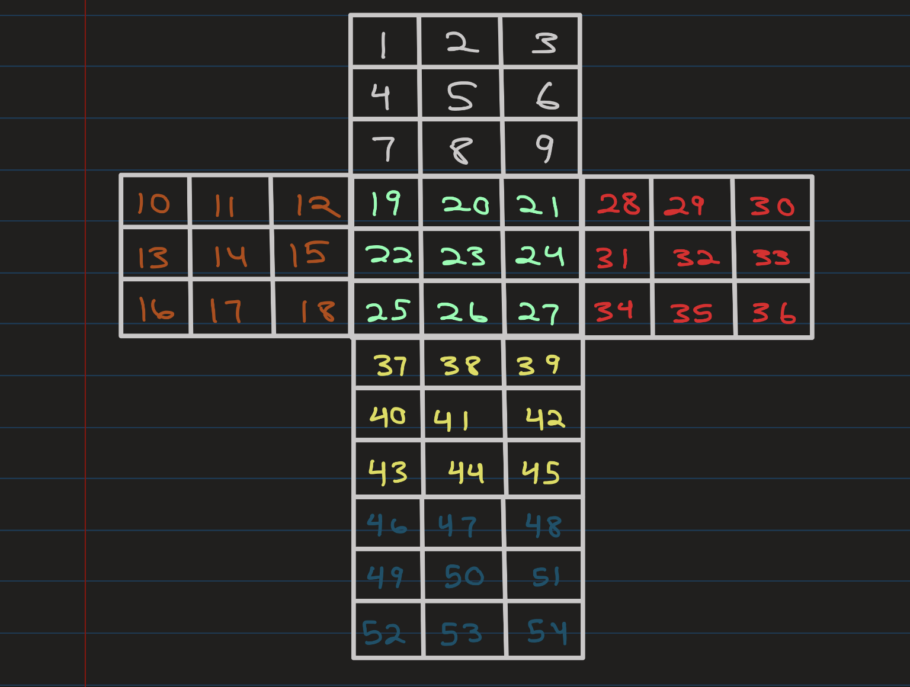

# RubiksCubeSolver
A Rubik's Cube Solver written in Java.

# Numerical Mapping
Below, you can see the `char[] cube = new char[54];` array that represents the Rubik's Cube:



# Cases for recognizing when to use algorithms

For example, let's say a case is that:
For the algorithm to be used,
cube spot 5 and 7 need to be white color, and cube spot 6 needs to be green.
```
public static char[] CaseExample(char[] cube)
{
    if (cube[4] == 'W' && cube[5] == 'G' && cube[6] == 'W')
    {
        // do the algorithm here
        cube = AlgorithmExample(cube);
    }
    return cube;
}
```

# Algorithms

Number of Algorithms:

Cross:

    4 Pieces * 12 spots * 2 sides = 96 cases

F2L:

    Corners:

    Edges:

    F2L:

OLL:

    1. Step (edges): 1 dot case + 1 finished cross + 2 line cases + 4 L cases = 8 cases
    2. Step (corners): T-case + H-case + U-case + L-case + Pi-case + Sune-case + Antisune-case * 4 Orientations = 28 cases

PLL:

    1. Step (corners): 2 diagonal case + 2 headlight cases = 4 cases
    2. Step (edges): 1 H-PLL + 4 Ua-cases + 4 Ub-cases + 2 Z-cases = 11 cases


```
public static char[] AlgorithmExample(char[] cube)
{
    cube = B_Move(cube);
    cube = F_Prime_Move(cube);
    cube = L_Prime_Move(cube);
    return cube;
}
```

# Move Example
```
public static char[] U_Move(char[] cube)
{
    // change the letters to be in the right spots
    char cube6 = cube[6];
    char cube0 = cube[0];
    char cube2 = cube[2];
    char cube8 = cube[8];
    char cube1 = cube[1];
    char cube5 = cube[5];
    char cube7 = cube[7];
    char cube3 = cube[3];
    char cube18 = cube[18];
    char cube19 = cube[19];
    char cube20 = cube[20];
    char cube27 = cube[27];
    char cube28 = cube[28];
    char cube29 = cube[29];
    char cube9 = cube[9];
    char cube10 = cube[10];
    char cube11 = cube[11];
    char cube51 = cube[51];
    char cube52 = cube[52];
    char cube53 = cube[53];

    // spot number 1 is changing to be the Farbe in spot 7
    cube[0] = cube6;

    // spot number 3 is changing to be the Farbe in spot 1
    cube[2] = cube0;
    
    // ...etc.

    // return the new array with the correct spots
    return cube;
}
```
